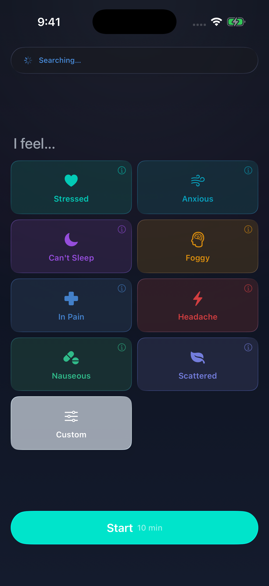

# Open Pulse

<p align="center">
  
</p>

A native iOS app for controlling [Pulsetto](https://pulsetto.tech) vagus nerve stimulation devices over Bluetooth.

Swift 6 / SwiftUI. No dependencies. No tracking. iOS 26+.

<p align="center">
  
  
</p>

## Modes

| Mode | Duration | Channel | Behavior |
|------|----------|---------|----------|
| Stress Relief | 6 min | Bilateral | Constant intensity |
| Sleep | 10 min | Rotating (D/A/D/C/D) | Gentle fade in last 20% |
| Focus | 6 min | Left only | 30s on/off cycles |
| Pain Relief | 8 min | Bilateral | Sine wave oscillation |
| Calm | 5 min | Bilateral | Exhale-gated with breathing guide |
| Custom | User-set | User-set | Manual control |

See [research.md](research.md) for citations and parameter rationale.

## Building

```bash
open OpenPulse.xcodeproj
# or
xcodebuild -project OpenPulse.xcodeproj -scheme OpenPulse \
  -destination 'generic/platform=iOS' build
```

## Attribution

Built on the BLE reverse engineering from [PulseLibre](https://github.com/jooray/PulseLibre) by [Juraj Bednar](https://github.com/jooray), with additional protocol work by [hydrasparx/pulsetto](https://github.com/hydrasparx/pulsetto) and [parallaxintelligencepartnership/pulse-libre](https://github.com/parallaxintelligencepartnership/pulse-libre).

## License

[GLWTS](LICENSE)
