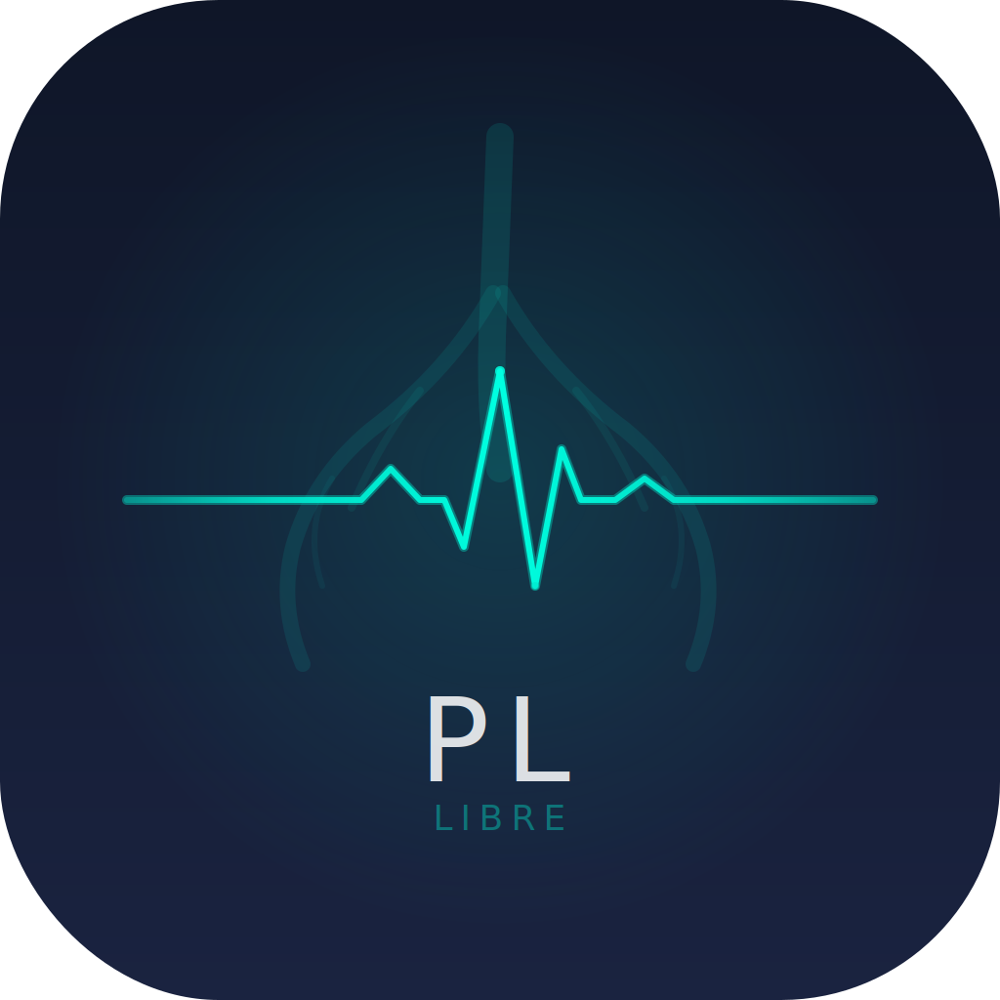
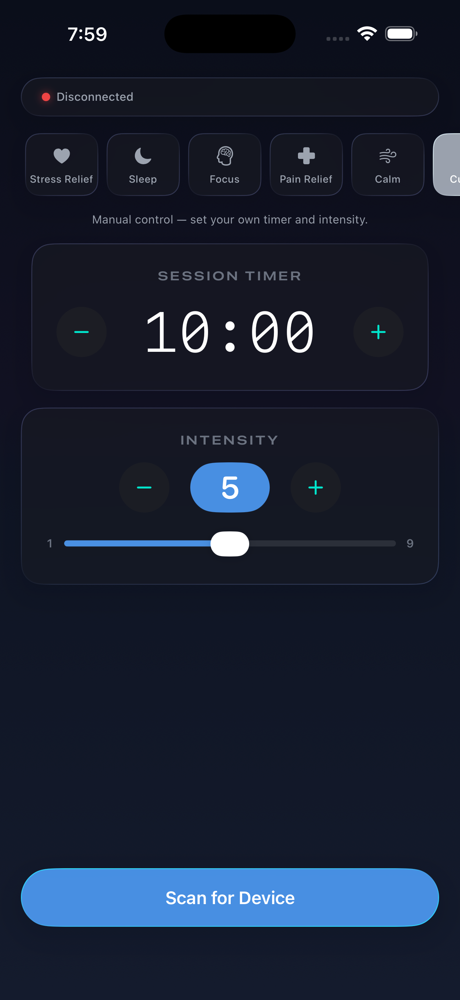

# Open Pulse

<p align="center">
  
</p>

A native iOS app for controlling [Pulsetto](https://pulsetto.tech) tVNS (transcutaneous vagus nerve stimulation) devices via Bluetooth Low Energy.

Built with Swift 6 and SwiftUI. Requires iOS 26+.

<p align="center">
  
</p>

## Features

- **6 evidence-based stimulation modes** — Stress Relief, Sleep, Focus, Pain Relief, Calm/Breathe, and Custom
- **Mode engine architecture** — each mode orchestrates channel selection, intensity modulation, and duty cycling in real time
- **Respiratory-gated stimulation** — Calm mode implements the RAVANS protocol (exhale-gated stimulation with guided breathing animation)
- **Pause/resume** — pause mid-session and resume with correct device state restoration
- **Live status display** — shows what the device is doing at all times (channel, phase, intensity changes)
- **Research links** — each mode links to the peer-reviewed studies that informed its design
- **Auto-reconnection** — session continues during BLE disconnects, resumes on reconnect
- **No internet, no tracking** — the app only uses Bluetooth

## Stimulation Modes

| Mode | Duration | Channel | Key Behavior | Evidence |
|------|----------|---------|--------------|----------|
| Stress Relief | 6 min | Bilateral | Constant intensity | Strong |
| Sleep | 10 min | D→A→D→C→D rotation | Gentle fade in last 20% | Moderate |
| Focus | 6 min | Left only | 30s on/off cycles, +1 bump at midpoint | Moderate-Strong |
| Pain Relief | 8 min | Bilateral | ±1 sine wave oscillation | Weak |
| Calm | 5 min | Bilateral | 4s inhale (off) / 6s exhale (on), breathing guide | Strong |
| Custom | User-set | Bilateral | Manual control | — |

See [research.md](research.md) for the full evidence base, citations, and parameter rationale.

## BLE Protocol

The Pulsetto device accepts simple ASCII commands over Nordic UART Service:

| Command | Effect |
|---------|--------|
| `D\n` | Activate bilateral (both channels) |
| `A\n` | Activate left channel only |
| `C\n` | Activate right channel only |
| `0\n` | Deactivate |
| `1`–`9\n` | Set intensity level |
| `Q\n` | Query battery voltage |
| `u\n` | Query charging status |

The device has no mode awareness — all mode behavior (channel rotation, duty cycling, intensity modulation, respiratory gating) is orchestrated by the app.

## Building

Open `OpenPulse.xcodeproj` in Xcode 26+, select your development team, and build for your iOS device.

```bash
xcodebuild -project OpenPulse.xcodeproj \
  -scheme OpenPulse \
  -destination 'generic/platform=iOS' \
  build
```

## Project Structure

```
OpenPulse/
├── Models/
│   ├── BLEConstants.swift       # BLE UUIDs, commands, intervals
│   ├── StimulationMode.swift    # Mode enum with metadata
│   └── ModeEngine.swift         # Protocol + 5 engine implementations
├── Services/
│   └── BluetoothManager.swift   # CoreBluetooth manager
├── ViewModels/
│   └── SessionViewModel.swift   # Session state, timer, mode integration
├── Views/
│   ├── ContentView.swift        # Root layout
│   ├── ModePicker.swift         # Horizontal mode cards
│   ├── TimerCardView.swift      # Countdown timer with status
│   ├── BreathingGuideView.swift # Animated breathing circle (Calm mode)
│   ├── StrengthCardView.swift   # Intensity control
│   ├── ActionButtonView.swift   # Start/Pause/Resume/Stop
│   ├── StatusBarView.swift      # Connection + battery
│   └── Theme.swift              # Colors + type scale
└── OpenPulseApp.swift           # App entry point
```

## Attribution

Open Pulse is a native iOS rewrite built on the foundation of [**PulseLibre**](https://github.com/jooray/PulseLibre) by [Juraj Bednar](https://github.com/jooray) ([@jooray](https://github.com/jooray)).

The original PulseLibre project — a React Native app for controlling Pulsetto devices — established the BLE protocol reverse engineering, command set, and battery parsing that this app builds upon. The BLE protocol was further documented by:

- [hydrasparx/pulsetto](https://github.com/hydrasparx/pulsetto) — Web Bluetooth implementation (discovered the A/C/D channel commands)
- [jooray/pulse-libre-desktop](https://github.com/jooray/pulse-libre-desktop) — Python desktop app
- [parallaxintelligencepartnership/pulse-libre](https://github.com/parallaxintelligencepartnership/pulse-libre) — Flutter app

Thank you to the PulseLibre community for making open-source vagal nerve stimulation possible.

## License

GLWTS (Good Luck With That Shit) Public License — same as the original [PulseLibre](https://github.com/jooray/PulseLibre).

See [LICENSE](LICENSE) for the full text.
