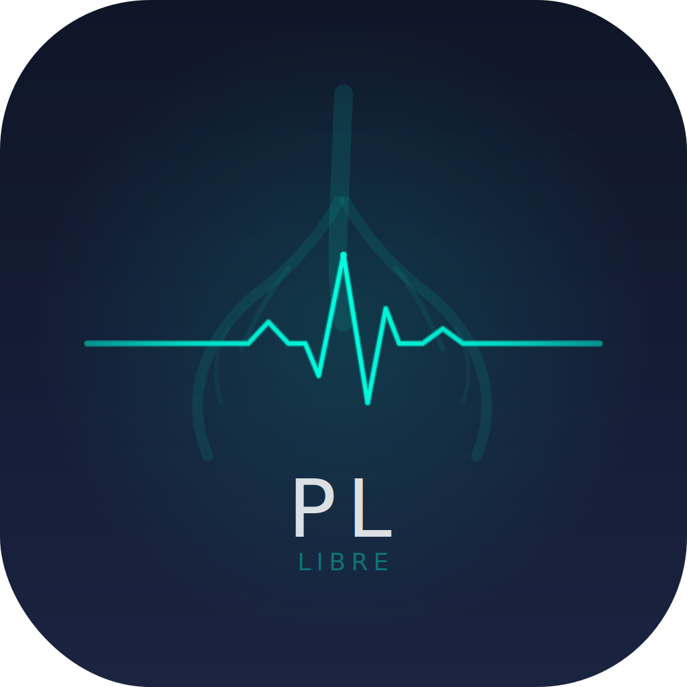
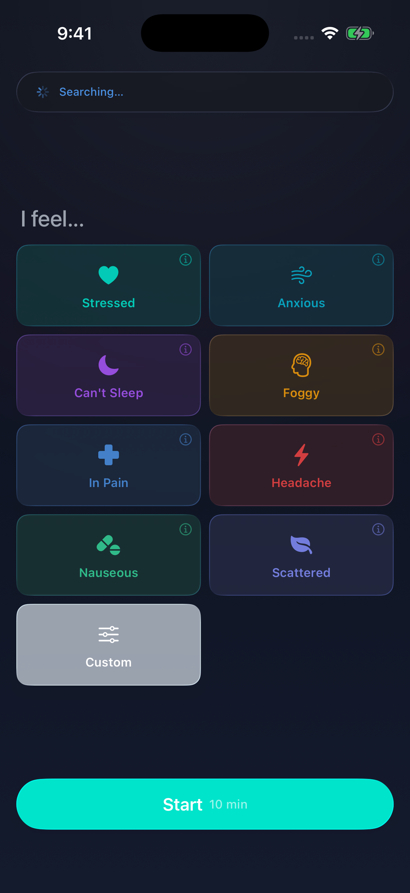
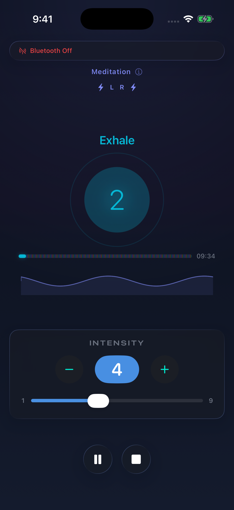

# Open Pulse

<p align="center">
  
</p>

A native iOS app for controlling [Pulsetto](https://pulsetto.tech) vagus nerve stimulation devices over Bluetooth.

Swift 6 / SwiftUI. No dependencies. No tracking. iOS 26+.

<p align="center">
  
  &nbsp;&nbsp;
  
</p>

## Modes

| Mode | Duration | Behavior | Evidence |
|------|----------|----------|----------|
| **Stress Relief** | 6 min | Bilateral, constant intensity | [Horinouchi 2024](https://pmc.ncbi.nlm.nih.gov/articles/PMC11099104/), [Forte 2022](https://peerj.com/articles/14447/), [Badran 2018](https://pmc.ncbi.nlm.nih.gov/articles/PMC6536129/) |
| **Sleep** | 10 min | Rotating channels, gentle fade-out | [Bottari 2024](https://onlinelibrary.wiley.com/doi/10.1111/jsr.13891), [Zhang 2024](https://jamanetwork.com/journals/jamanetworkopen/fullarticle/2828072), [Wu 2022](https://pmc.ncbi.nlm.nih.gov/articles/PMC9599790/) |
| **Focus** | 6 min | Left-side only, 30s on/off duty cycles | [Sun 2021](https://www.frontiersin.org/journals/neuroscience/articles/10.3389/fnins.2021.790793/full), [Morrison 2018](https://pmc.ncbi.nlm.nih.gov/articles/PMC6347516/), [Sharon 2021](https://pmc.ncbi.nlm.nih.gov/articles/PMC7810665/) |
| **Pain Relief** | 8 min | Bilateral, sine wave oscillation | [Straube 2015](https://pubmed.ncbi.nlm.nih.gov/26156114/), [Pantaleao 2011](https://pubmed.ncbi.nlm.nih.gov/21277840/), [CPM 2024](https://pmc.ncbi.nlm.nih.gov/articles/PMC11543976/) |
| **Calm** | 5 min | Exhale-gated with breathing guide | [Sclocco 2019](https://pmc.ncbi.nlm.nih.gov/articles/PMC6592731/), [Garcia 2021](https://pmc.ncbi.nlm.nih.gov/articles/PMC8429271/), [Paleczny 2019](https://pmc.ncbi.nlm.nih.gov/articles/PMC8041682/) |
| **Headache** | 6 min | High-intensity bilateral bursts (gammaCore protocol) | [nVNS meta-analysis 2023](https://pmc.ncbi.nlm.nih.gov/articles/PMC10213755/), [gammaCore registry](https://pubmed.ncbi.nlm.nih.gov/32109020/) |
| **Nausea** | 5 min | Continuous bilateral, anti-nausea pathways | [nVNS gastroparesis 2023](https://journals.lww.com/ajg/fulltext/2023/10001/s1846_non_invasive_vagal_nerve_stimulation_reduces.2187.aspx), [taVNS motion sickness 2024](https://pmc.ncbi.nlm.nih.gov/articles/PMC11531436/) |
| **Meditation** | 10 min | Slower respiratory gating (5 breaths/min) | [tVNS + meditation RCT 2025](https://pmc.ncbi.nlm.nih.gov/articles/PMC12341030/), [Sclocco 2019](https://pmc.ncbi.nlm.nih.gov/articles/PMC6592731/) |
| **Custom** | User-set | Manual control | — |

See [research.md](research.md) for full citations and parameter rationale.

## Building

```bash
open OpenPulse.xcodeproj
# or
xcodebuild -project OpenPulse.xcodeproj -scheme OpenPulse \
  -destination 'generic/platform=iOS' build
```

## Attribution

Built on the BLE reverse engineering from [PulseLibre](https://github.com/jooray/PulseLibre) by [Juraj Bednar](https://github.com/jooray), with additional protocol work by [hydrasparx/pulsetto](https://github.com/hydrasparx/pulsetto) and [parallaxintelligencepartnership/pulse-libre](https://github.com/parallaxintelligencepartnership/pulse-libre).

## License

[GLWTS](LICENSE)
